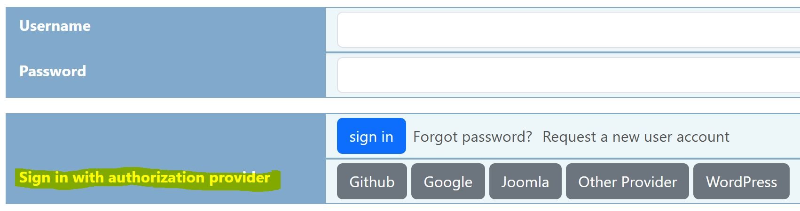
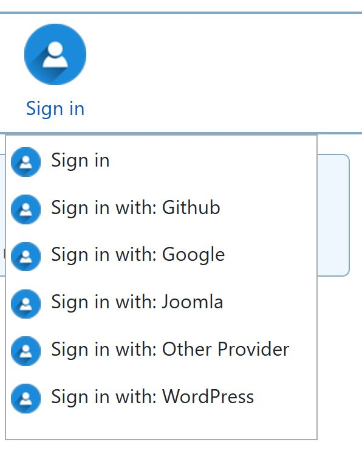
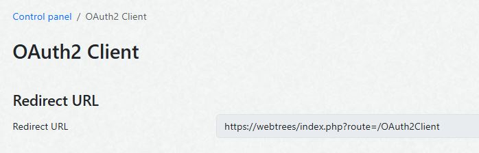
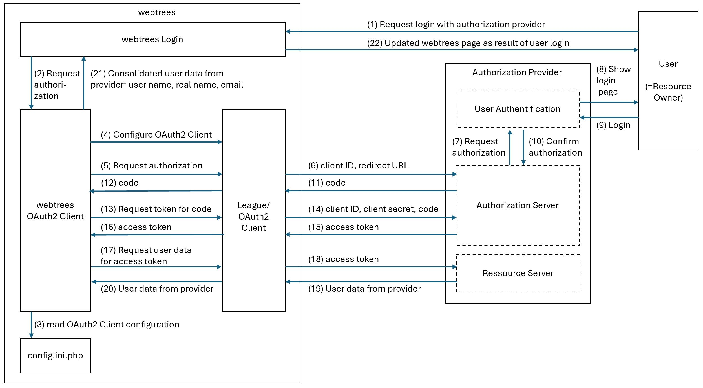

[](https://github.com/Jefferson49/webtrees-oauth2-client/releases/latest)
[](https://webtrees.net/download)
[](https://webtrees.net/download)

# OAuth 2.0 Client for webtrees
A [webtrees](https://webtrees.net) 2.1/2.2 custom module to provide [OAuth 2.0](https://en.wikipedia.org/wiki/OAuth) single sign on ([SSO](https://en.wikipedia.org/wiki/Single_sign-on)) with OAuth 2.0 authorization providers.

##  Table of contents
This README file contains the following main sections:
+   [What are the benefits of this module?](#what-are-the-benefits-of-this-module)
+   [IMPORTANT SECURITY NOTES](#important-security-notes)
+   [Installation](#installation)
+   [Supported Authorization Providers](#supported-authorization-providers)
+   [Sign On Options](#sign-on-options)
+   [Handling of User Name and Email](#handling-of-user-name-and-email)
+   [Configuration of Authorization Providers](#configuration-of-authorization-providers)
    + [General Configuration](#general-configuration)
    + [Generic](#generic)
    + [Authentik](#authentik)
    + [Dropbox](#dropbox)
    + [Github](#github)
    + [Google](#google)
    + [Joomla](#joomla)
    + [Kanidm](#kanidm)
    + [Keycloak](#keycloak)
    + [Nextcloud](#nextcloud)
    + [PocketID](#pocketid)
    + [Spotify](#spotify)
    + [WordPress](#wordpress)
+   [PKCE (Proof Key for Code Exchange)](#pkce-proof-key-for-code-exchange)
+   [Trouble Shooting](#trouble-shooting)
+   [Concept](#concept)
    + [Definitons](#definitions)
    + [Protocol Flow](#protocol-flow)
+   [Webtrees Version](#webtrees-version)
+   [Translation](#translation)
+   [Bugs and Feature Requests](#bugs-and-feature-requests)
+   [License](#license)
+   [Github Repository](#github-repository)

## What are the benefits of this module?
+ The module provides single sign on ([SSO](https://en.wikipedia.org/wiki/Single_sign-on)) into the [webtrees](https://webtrees.net) application based on the [OAuth 2.0](https://en.wikipedia.org/wiki/OAuth) standard.
+ A pre-configured set of authorization providers can be selected during webtrees login.
+ If choosing to register with an authorization provider, the user account data (i.e. user name, real name, email address) of the authorization provider is used to create a new user account in webtrees.
+ Alternatively, an existing webtrees user can be connected to an authorization provider. In this case, the user credentials in webtrees stay the same. However, an additional way to sign into the webtrees account is provided.
+ If offered by the authorization provider, multi factor authorization ([MFA](https://en.wikipedia.org/wiki/Multi-factor_authentication)) can be used for webtrees sign in.

[](resources/img/login_page_with_authorization_providers.jpg)

[](resources/img/sign_in_custom_menu.jpg)

## IMPORTANT SECURITY NOTES
It is **highly recommended to use** the **HTTPS** protocol for your webtrees installation. The [HTTPS](https://en.wikipedia.org/wiki/HTTPS) protocol will ensure the encryption of the communication between webtrees and the authorization provider for a secure exchange of secret IDs and secret access tokens.

Please check whether your **webtrees BASE_URL** in the config.ini.php file **starts with "https"**, e.g. https://my_site.net/webtrees.

## Installation
+ Download the [latest release](https://github.com/Jefferson49/webtrees-oauth2-client/releases/latest) of the module by downloading the "**oauth2_client_v\*.zip**" file from "Assets". Do not download "Source code.zip".
+ Unzip the downloaded file and copy the included folder "oauth2_client" into the "module_v4" folder of your webtrees installation
+ Check if the module is activated in the control panel:
  + Login to webtrees as an administrator
	+ Go to "Control Panel/All Modules", and find the module called "ExtendedImportExport"
	+ Check if it has a tick for "Enabled"

## Sign On Options

The OAuth 2.0 Client offers two different options to sign on with an authorization provider:
+ **Register a new webtrees user based on the identity provided by an authorization provider**: Sign out and choose to sign in with an authorization provider. A new webtrees user will be registered. The registration will fail if the email or the user name, which is transmitted by the authorization provider, already exists within webtrees. After the registration, a webtrees administrator needs to approve the new user and the email before signing in with the authorization provider is possible. The general idea of this option is that the user identify from the authorization provider is used within webtrees. In the control panel, a setting is offered to synchronize the email address from the authorization provider to the webtrees user.
+ **Connect an existing webtrees user with an authorization provider**: Sign on with an exisiting user and choose to "connect" the existing user with an authorization provider. In this case, the existing user credentials in webtrees will continue to exist and the user will be (additionally) allowed to sign in with the chosen provider. The general idea of this is that the two user accounts exist in parallel and are connected.

## Handling of User Name and Email

If a new webtrees user is created (i.e. registered), the user name and the email needs to be unique. This is a general webtrees requirement. If the user name or email address provided by the authorization provider is identical to an already existing user, an error message will be shown. 

## Supported Authorization Providers
The OAuth 2.0 Client for webtrees uses the OAuth 2.0 implementation of the [The League](https://oauth2-client.thephpleague.com/), which allows developers to create OAuth 2.0 clients that interface with a wide-variety of OAuth 2.0 providers. Within this concept, The League supports serveral "[official providers](https://oauth2-client.thephpleague.com/providers/league/)". As far as suitable for webtrees, these official providers were included, see list below. 

Currently, the following authorization providers are supported:
+ **Generic** (can be configured for several authorization providers)
+ **Authentik** (can be configured with the Generic provider)
+ **Dropbox**
+ **Github**
+ **Google**
+ **Joomla** (with a specific authorization provider extension installed in Joomla)
+ **Kanidm**
+ **Keycloak**
+ **Nextcloud**
+ **PocketID** (can be configured with the Generic provider)
+ **Spotify**
+ **WordPress** (with a specific authorization provider plugin installed in WordPress)

To use further authorization providers, the following approaches are available:
+ Use the Generic authorization provider, which can be adopted to a wide range of authorization providers.
+ There are a large number of [3rd party provider clients](https://oauth2-client.thephpleague.com/providers/thirdparty/) available, which follow the same software structure and interfaces from [The League](https://oauth2-client.thephpleague.com/). The code of the OAuth 2.0 Client for webtrees allows to flexibly integrate further members of this set of provider clients. You can file a [feature request](#bugs-and-feature-requests), if you are interested in a specific provider.

## Configuration of Authorization Providers
### General Configuration
In general, the following steps need to be taken to configure an authorization provider:
+ Login on the provider web page
+ Register an OAuth2 app (or web app)
+ Provide the **redirect URL** (or callback URL) from webtrees (see description/screenshot below) to the registered app.
+ Get the **client ID** for the registered app
+ Get (or generate) the **client secret** for the registered app
+ Enter the client ID and client secret into your webtrees configuratin file (config.ini.php)

In order to get the redirect URL, open the module settings in the control panel and copy the shown value.



In the following, the configuration is described for a subset of authorization providers. Simular configuration procedures apply to other providers. 

### Generic
+ Configure the OAuth 2.0 server, which shall be used as authorization provider.
+ Configure the "Redirect URL" to webtrees within the OAuth 2.0 server. See chapter [General Configuration](#general-configuration) about how to get the redirect URL from the module settings.
+ Create and check the "Client ID", and "Client Secret" within the OAuth 2.0 server.
+ Open your webtrees config.ini.php file and add the following lines (copy/paste to the end):
```PHP
Generic_clientId='xxx'
Generic_clientSecret='xxx'
Generic_urlAuthorize='xxx'
Generic_urlAccessToken='xxx'
Generic_urlResourceOwnerDetails='xxx'
Generic_signInButtonLabel='xxx'
```
+ Insert the configuration details from the OAuth 2.0 Server into the newly included configuration lines of your config.ini.php file:
    + **Generic_clientId**='...' (value from the OAuth 2.0 Server)
    + **Generic_clientSecret**='...' (value from the OAuth 2.0 Server)
    + **Generic_urlAuthorize**='...' (value from the OAuth 2.0 Server)
    + **Generic_urlAccessToken**='...' (value from the OAuth 2.0 Server)
    + **Generic_urlResourceOwnerDetails**='...' (value from the OAuth 2.0 Server)
    + **Generic_signInButtonLabel**='...' (the label, which shall be shown for the sign in button etc.)

### Authentik
+ Use the [Generic client](#generic) to connect with Authentik
+ Authentik configuration:
    + Customized > Property Mappings > Create > Scope Mapping  
        + Name: uid to id
        + scope name: hashed-id
        + description: blank
        + expression:
            ```
            return {
            "id": request.user.uid,
            }
            ```
            Note: This doesn't have to be uid, but it gives the same as the default hashed-id. It is not recommended to use id, since that simple integer can collide with other systems.
        + Name: username
        + scope name: username
        + description: Username
        + expression:
            ```
            return {
            "username": request.user.username,
            }
            ```
    + When creating the OAuth2 Provider, select:
        + Client Type: Confidential
        + Scopes:
            + OpenID 'email'
            + OpenID 'openid'
            + OpenID 'profile'
            + uid to id
            + username
        + Subject Mode: hashed ID (but this is not used anyways, it SHOULD be this/sub and not id for OIDC)

### Dropbox
+ Open the [Dropbox](https://www.dropbox.com/login) page and log into your Dropbox account
+ Open the [Apps page](https://www.dropbox.com/developers/apps)
+ Click on the "Create app" button on the right side
+ Select "Scoped access"
+ Select "App folder"
+ Provide a a name in "Name your app"
+ Press "Create app" button on the lower right side
+ At "Development users", press button "Enable additional users"
+ At "OAuth 2: Redirect URIs", enter the redirect URL and press the "Add" button. See chapter [General Configuration](#general-configuration) about how to get the redirect URL from the webtrees custom module settings.
+ Open your webtrees config.ini.php file and add the following lines (copy/paste to the end):
```PHP
Dropbox_clientId='xxx'
Dropbox_clientSecret='xxx'
```
+ Insert the configuration details from your Dropbox App into the newly included configuration lines of your config.ini.php file:
    + **Dropbox_clientId**='...' (value for "App key" shown in Dropbox, like described above)
    + **Dropbox_clientSecret**='...' (value for "App secret" shown in Dropbox, like described above)

### Github
+ Open the [Github](https://github.com/) page and log into your Github account
+ Click on the symbol for your user account on the top right side of the browser
+ Choose "Settings" from the profile menu
+ Choose "Developer settings" on the bottom left side
+ Choose "OAuth2 Apps"
+ Click the button "New OAuth2 App" on the right side
+ Enter the data for the GitHub App:
    + Application name: Can be freely chosen, e.g. "webtrees - Miller family" 
    + Homepage URL: **BASE_URL** (from webtress config.ini.php)
    + Authorization callback URL: See chapter [General Configuration](#general-configuration) about how to get the redirect URL from the module settings.
+ Press button "Register application"
+ Press button "Create a new client secret"
+ Copy the newly created client secret to a save place
+ Open your webtrees config.ini.php file and add the following lines (copy/paste to the end):
```PHP
Github_clientId='xxx'
Github_clientSecret='xxx'
```
+ Insert the configuration details from your Github OAuth2 App into the newly included configuration lines of your config.ini.php file:
    + **Github_clientId**='...' (value shown in Github, like described above)
    + **Github_clientSecret**='...' (value shown in Github, like described above)
+ Press button "Update Application" 

### Google
+ Open the [Google API credential](https://console.cloud.google.com/apis/credentials) page and log into your Google account
+ Select the drop down menu next to the "Google Cloud" icon and select **NEW PROJECT**
+ Enter a project name
+ For organization, choose "No organization"
+ Press the "CREATE" button
+ Enter language/region data (or keep the default) and press the "SAVE" button
+ From the menu on the left side, choose "APIs and services" and sub menu "OAuth consent screen"
+ Select "External" and press "CREATE" button
+ Enter the "App name", "User support email", and "Developer contact information"; do not enter data regarding the app domain
+ Press button "CREATE ÁND CONTINUE"
+ On the pages about scopes and test users, just press "SAVE AND CONTINUE"
+ Finally, press button "BACK TO DASHBOARD"
+ From the menu on the left side, choose "Credentials"
+ Click the "CREATE CREDENTIALS" button (top middle) and select "OAuth client ID"
+ For "Application type", select "Web application"
+ Enter a name
+ At "Authorised redirect URIs", press the "ADD URI" button
+ Enter the redirect URL and press the "CREATE" button. See chapter [General Configuration](#general-configuration) about how to get the redirect URL from the webtrees custom module settings.
+ From the pop window, copy the **Client ID** and the **Client secret**
+ Copy the client secret to a save place
+ Open your webtrees config.ini.php file and add the following lines (copy/paste to the end):
```PHP
Google_clientId='xxx'
Google_clientSecret='xxx'
```
+ Insert the configuration details from your Github OAuth2 App into the newly included configuration lines of your config.ini.php file:
    + **Google_clientId**='...' (value shown in Google, like described above)
    + **Google_clientSecret**='...' (value shown in Google, like described above)
+ Press the "OK" button in the Google browser page

### Joomla
+ Download the Joomla extension [joomla-oauth2-server](https://github.com/Jefferson49/joomla-oauth2-server/releases/latest)
+ Install the extension in the Joomla administration backend
+ Open the backend menu: Components / OAuth2 Server / Configure OAuth
+ Click on the button "Add client"
+ Enter a name for "Client Name", e.g. "webtrees"
+ Enter the "Authorized Redirect URL" for the webtrees OAuth 2.0 client. See chapter [General Configuration](#general-configuration) about how to get the redirect URL from the webtrees custom module settings
+ Find the following configuration parameters in the list of OAuth clients, which are needed for the webtrees configuration in config.ini.php below:
    + Client ID
    + Client Secret
+ Click on "Endpoint URLs" to find the following configuration parameter, which is needed for the webtrees configuration in config.ini.php below:
    + Authorize Endpoint 
+ Open your webtrees config.ini.php file and add the following lines (copy/paste to the end):
```PHP
Joomla_clientId='xxx'
Joomla_clientSecret='xxx'
Joomla_urlAuthorize='xxx'
Joomla_signInButtonLabel='xxx'
```
+ Insert the configuration details from the Joomla OAuth 2.0 Server into the newly included configuration lines of your config.ini.php file:
    + **Joomla_clientId**='...' (value for "Client ID" shown in Joomla)
    + **Joomla_clientSecret**='...' (value for "Client Secret"  shown in Joomla)
    + **Joomla_urlAuthorize**='JOOMLA_BASE_URL/index.php' (JOOMLA_BASE_URL from your Joomla installation, e.g. 'https://mysite.net/joomla')
    + **Joomla_signInButtonLabel**='...' (the label, which shall be shown for the sign in button etc.)

### Kanidm
+ For a description about the Kanidm configuration, refer to the chapter about OAuth2 configuration in the [Kanidm Administration Manual](https://kanidm.github.io/kanidm/stable/integrations/oauth2.html)
+ Configure your client in Kanidm
+ Open your webtrees config.ini.php file and add the following lines (copy/paste to the end):
```PHP
Kanidm_clientId='xxx'
Kanidm_clientSecret='xxx'
Kanidm_kanidmUrl='xxx'
Kanidm_signInButtonLabel='xxx'
Kanidm_pkceMethod='S256'
```
+ Insert the configuration details from your Kanidm installation into the newly included configuration lines of your config.ini.php file:
    + **Kanidm_clientId**='...' (the "client id" used in Kanidm)
    + **Kanidm_clientSecret**='...' (value for "Client Secret" shown in Kanidm)
    + **Kanidm_kanidmUrl**='...' (the URL of your Kanidm server)
    + **Kanidm_signInButtonLabel**='...' (the label, which shall be shown for the sign in button etc.)

### Keycloak
+ Log into your Keycloak administration backend and select or create a realm
+ Create a new client with "Client" / "Create client"
+ In "General settings" enter a "Client ID" and select "OpenID Connect" for "Client type"
+ In "Capability config" switch on "Client authentication" and "Authorization". For "Authentication flow" activate "Standard flow".
* Note: Any time switching on/off the "Client authentification", the "Client credentials" (e.g. "Client Secret") will also be modified/updated. Therefore, you will need to update the "Client Secret" in the webtrees config.ini.php accordingly; otherwise the authentification might fail.
+ In "Login settings", enter the "Valid redirect URIs". See chapter [General Configuration](#general-configuration) about how to get the redirect URL from the webtrees custom module settings.
+ Press "Save" button.
+ With "Client Scopes" / "New client scope", create an additional "openid" scope (if it does not exist already).
+ Enable the "include in token scope" slider for the additional "openid" scope.
+ In "Clients" / "Client scopes" / "Add client scopes", add the additional "openid" scope to the webtrees client as "Default" scope.
+ Open your webtrees config.ini.php file and add the following lines (copy/paste to the end):
```PHP
Keycloak_clientId='xxx'
Keycloak_clientSecret='xxx'
Keycloak_authServerUrl='xxx'
Keycloak_realm='xxx'
Keycloak_signInButtonLabel='xxx'
```
+ Insert the configuration details from your Keycloak installation into the newly included configuration lines of your config.ini.php file:
    + **Keycloak_clientId**='...' (value for "Client ID" shown in Keycloak)
    + **Keycloak_clientSecret**='...' (value for "Client Secret"  shown in Keycloak, "Clients" / "Credentials" / "Client secret")
    + **Keycloak_authServerUrl**='...' (URL of your Keycloak server)
    + **Keycloak_realm**='xxx' (value for "Realm name" shown in Keycloak)
    + **Keycloak_signInButtonLabel**='...' (the label, which shall be shown for the sign in button etc.)

### Nextcloud
+ For a description about the Nextcloud configuration, open the chapter about OAuth2 configuration in the [Nextcloud Administration Manual](https://docs.nextcloud.com/server/latest/admin_manual/configuration_server/oauth2.html#add-an-oauth2-application)
+ Configure a new OAuth2 client app in Nextcloud like described in chapter "Add an OAuth2 Application"
+ Open your webtrees config.ini.php file and add the following lines (copy/paste to the end):
```PHP
Nextcloud_clientId='xxx'
Nextcloud_clientSecret='xxx'
Nextcloud_nextcloudUrl='xxx'
Nextcloud_signInButtonLabel='xxx'
```
+ Insert the configuration details from your Nextcloud server into the newly added configuration lines of your config.ini.php file:
    + **Nextcloud_clientId**='...' (value for "Client Identifyer" shown in Nextcloud)
    + **Nextcloud_clientSecret**='...' (value for "Client Secret"  shown in Nextcloud)
    + **Nextcloud_nextcloudUrl**='NEXTCLOUD_BASE_URL' (NEXTCLOUD_BASE_URL from your Nextcloud installation, e.g. 'https://mysite.net/nextcloud')
    + **Nextcloud_signInButtonLabel**='...' (the label, which shall be shown for the sign in button etc.)

### PocketID
It was reported by a user that PocketID was successfully connected with the [Generic](#generic) authorization provider. However, the details of the configuration of PocketID and the Generic provider are not known to the module author.

### Spotify
+ Open the [Spotify](https://open.spotify.com/login) page and log into your Dropbox account
+ Open the [Create apps page]( https://developer.spotify.com/dashboard/create)
+ Insert an "App name" and an "App description"
+ Insert a "Website", e.g. the URL of your website
+ Insert the "Redirect URIs". See chapter [General Configuration](#general-configuration) about how to get the redirect URL from the webtrees custom module settings.
+ Press "Add" button to add the redirect URI.
+ Select the checkbox for "Web API"
+ Agree to the terms of service
+ Press "Save" button
+ Open your webtrees config.ini.php file and add the following lines (copy/paste to the end):
```PHP
Spotify_clientId='xxx'
Spotify_clientSecret='xxx'
```
+ Insert the configuration details from your Spotify app into the newly included configuration lines of your config.ini.php file:
    + **Spotify_clientId**='...' (value shown in Spotify, like described above)
    + **Spotify_clientSecret**='...' (value shown in Spotify, like described above)

### WordPress
+ Download the WordPress plugin [WP OAuth Server](https://wordpress.org/plugins/miniorange-oauth-20-server/)
+ Install the plugin in the WordPress administration backend
+ Open the plugin settings in the administration backend
+ Click on the card "Configure Application"
+ Search/Select "Custom OAuth Client"
+ Enter a name for "Client Name", e.g. "webtrees"
+ Enter the "Callback/Redirect URI" for the webtrees OAuth 2.0 client. See chapter [General Configuration](#general-configuration) about how to get the redirect URL from the webtrees custom module settings.
+ Save
+ Find the following configuration parameters for the "Configured Client", which are needed for the webtrees configuration in config.ini.php below:
    + Client ID
    + Client Secret
    + Authorization Endpoint
    + Token Endpoint
    + Userinfo Endpoint
+ Open your webtrees config.ini.php file and add the following lines (copy/paste to the end):
```PHP
WordPress_clientId='xxx'
WordPress_clientSecret='xxx'
WordPress_urlAuthorize='xxx'
WordPress_urlAccessToken='xxx'
WordPress_urlResourceOwnerDetails='xxx'
WordPress_signInButtonLabel='WordPress'
```
+ Insert the configuration details from the WP OAuth Server plugin into the newly included configuration lines of your config.ini.php file:
    + **WordPress_clientId**='...' (value for "Client ID" shown in the WordPress plugin, like described above)
    + **WordPress_clientSecret**='...' (value for "Client Secret" shown in the WordPress plugin, like described above)
    + **WordPress_urlAuthorize**='...' (value for "Authorization Endpoint" shown in the WordPress plugin, like described above)
    + **WordPress_urlAccessToken**='...' (value for "Token Endpoint" shown in the WordPress plugin, like described above)
    + **WordPress_urlResourceOwnerDetails**='...' (value for "Userinfo Endpoint" shown in the WordPress plugin, like described above)
    + **WordPress_signInButtonLabel**='...' (the label, which shall be shown for the sign in button etc.)    

#### PHP/Apache configuration
If using Apache and the OAuth 2 authorization fails, check the following settings: 
+ In certain PHP/Apache configurations, PHP is not receiving GET headers and GET requests for authorization and the OAuth 2 authorization will fail.
+ In order to solve this issue, a line with the Apache settings below needs to be added to the Apache .htaccess configuration file.
+ If you already use an .htaccess file on your server, you should add this line. If you do not yet have an .htaccess file, create an empty file and insert the mentioned line. Afterwards, use FTP to transfer this file into the top directory of your WordPress installation.
```PHP
SetEnvIf Authorization "(.*)" HTTP_AUTHORIZATION=$1
```
## PKCE (Proof Key for Code Exchange)
The Generic and Kanidm authorization providers support to use PKCE.  

In order to activate PKCE for the **Generic provider**, the following configuration needs to be added to the config.ini.php file in webtrees: 
```PHP
Generic_pkceMethod='S256'
```
In Kanidm, PKCE is activated by default. Therefore, the PKCE configuration is included in the [Kanidm chapter](#kanidm).

## Trouble Shooting
Although OAuth 2 is a standard protocol and is used on lots of websites, the authorization process is very sensitive to certain server configurations. The list below provides some hints for trouble shooting:
+ Study any webtrees flash messages of the OAuth2 client with error messages, which might contain valuable hints for trouble shooting
+ **Activate debug logs** in the module settings
+ Check the debug logs of the OAuth2 client in the webtrees website logs (control panel)
+ Check your website access logs for requested URLs, HTTP request methods, HTTP status/error codes
+ Check the logs for any 301/302 redirects. Within 301 or 302 redirects, the server might change HTTP POST methods into GET methods
+ Check if your website uses the HTTPS protocol. A lot of authorization providers require to use the HTTPS protocol for OAuth 2 autorization. HTTPS is strongly recommended for security reasons anyway.
+ Check the server configuration for any redirects from sub-domains, e.g. https://www.my_site.net to https://my_site.net
+ If using the WordPress authorization provider, check the [PHP/Apache configuration](#phpapache-configuration)

## Definitions 
[RFC 6749](https://datatracker.ietf.org/doc/html/rfc6749) defines several roles, which are used in OAuth. In the context of the OAuth 2.0 Client and webtrees single sign on, the OAuth [roles](https://datatracker.ietf.org/doc/html/rfc6749#section-1.1) and definitions are used as follows:
+ **Resource Owner**: The webtrees user.
+ **Ressource**: The user data (e.g. user name, real name, email address, ...), which belong to the webtrees user while using a 3rd party webservice (e.g. Github, Google, Joomla).
+ **Client**: The webtrees application used in a web browser.
+ **Authorization Provider**: A 3rd party web application, which usually provides the "Authorization Server", the "Ressource Server", and the "User Authentification" in one entity.
+ **Authorization Server**: A part of the Authorization Provider, which is issuing access tokens to  webtrees after successfully authenticating the webtrees user.
+ **Ressource Server**: A part of the Authorization Provider, which is responding the protected user data (e.g. user name, real name, email address) on requests with authenticated access tokens.
+ **User Authentification**: A part of the Authorization Provider, which is providing 3rd party user login and authentification.

## Concept
+ "OAuth (short for open authorization) is an open standard for access delegation, commonly used as a way for internet users to grant websites or applications access to their information on other websites but without giving them the passwords." \[[wikipedia](https://en.wikipedia.org/wiki/OAuth)\].
+ The "OAuth 2.0 authorization framework enables a third-party application to obtain limited access to an HTTP service [...] on behalf of a resource owner by orchestrating an approval interaction between the resource owner and the HTTP service" \[[RFC 6749](https://datatracker.ietf.org/doc/html/rfc6749)\].
+ The OAuth 2.0 standard is specified in [RFC 6749](https://datatracker.ietf.org/doc/html/rfc6749).
+ The OAuth 2.0 Client for webtrees uses the OAuth2 implementation of the [League/oauth2-client](https://oauth2-client.thephpleague.com/) by configuring/using it with the code as described in [basic usage](https://oauth2-client.thephpleague.com/usage/) of the League/oauth2-client.
+ The OAuth 2.0 Client for webtrees requests the user data (i.e. user name, real name, email address) from the authorization provider.
+ After submitting a request to login with an authorization provider, the user will be redirected to a website with the authorizaton provider's user authentification.
+ With the login at the authorization provider, the user (Resource Owner) confirms to use the user data (Ressource) from the authorization provider in webtrees. Some authorizaton providers (e.g. Google) explicitly request to confirm the usage of the user data. Others (e.g. Github) provide access by simply login.

### Protocol Flow
The following figure shows how the protocol flow of [RFC 6749](https://datatracker.ietf.org/doc/html/rfc6749) is implemented. For further descriptions of the protocol flow, please refer to the following chapters of [RFC 6749](https://datatracker.ietf.org/doc/html/rfc6749) and the description of the [League/OAuth2 Client](https://oauth2-client.thephpleague.com/):
+ [OAuth 2 Protocol Flow](https://datatracker.ietf.org/doc/html/rfc6749#section-1.2)
+ [Authorization Code Grant](https://datatracker.ietf.org/doc/html/rfc6749#section-4.1)
+ [League/OAuth2 Client](https://oauth2-client.thephpleague.com/)



## Webtrees Version
The module was developed and tested with [webtrees 2.1.21 and 2.2.1](https://webtrees.net/download), but should also run with any other 2.1/2.2 versions.

## Translation
Currently, the following languages are available:
+ English (Australian, British)
+ German

You can help to translate this module. The language files are available on [POEditor](https://poeditor.com/join/project/HyBUm95T1U), where you can update them or add new languages.

Alternatively, you can directly edit the .po translation text files, which can be found in [/resources/lang/](resources/lang). You can use a specific editor like [Poedit](https://poedit.net/) or a text editor like notepad++ to work on translations and provide them in the [Github repository](https://github.com/Jefferson49/webtrees-oauth2-client) of the module. You can do this via a pull request (if you know how to do), or by opening a new issue and attaching a .po file. 

Updated translations will be included in the next release of this module.

## Bugs and Feature Requests
If you experience any bugs or have a feature request for this webtrees custom module, you can [create a new issue](https://github.com/Jefferson49/webtrees-oauth2-client/issues).

## License
+ [GNU General Public License, Version 3](LICENSE.md)

This program is free software: you can redistribute it and/or modify it under the terms of the GNU General Public License as published by the Free Software Foundation, either version 3 of the License, or (at your option) any later version.

This program is distributed in the hope that it will be useful, but WITHOUT ANY WARRANTY; without even the implied warranty of MERCHANTABILITY or FITNESS FOR A PARTICULAR PURPOSE. See the GNU General Public License for more details.

You should have received a copy of the GNU General Public License along with this program. If not, see https://www.gnu.org/licenses/.

## Contributions and Copyrights
+ webtrees
    + [webtrees](https://webtrees.net): online genealogy
    + Copyright (c) 2025 [webtrees development team](http://webtrees.net)
+ League
    + [oauth2-client](https://github.com/thephpleague/oauth2-client)
        + Copyright (c) 2013-2025 Alex Bilbie
    + [oauth2-github](https://github.com/thephpleague/oauth2-github)
        + Copyright (c) 2015 Steven Maguire
    + [oauth2-google](https://github.com/thephpleague/oauth2-google)
        + Copyright (c) 2015 Woody Gilk
+ stevenmaguire
    + [oauth2-dropbox](https://github.com/stevenmaguire/oauth2-dropbox)
        + Copyright (c) 2015-2021 Steven Maguire
    + [oauth2-keycloak](https://github.com/stevenmaguire/oauth2-keycloak)
        + Copyright (c) 2015-2018 Steven Maguire
+ bahuma20
    + [oauth2-nextcloud](https://github.com/bahuma20/oauth2-nextcloud)
        + Copyright (c) 2020-2023 Max Bachhuber
+ Vesta Common (webtrees custom module)
    + [Cissee\WebtreesExt\More18N](https://github.com/vesta-webtrees-2-custom-modules/vesta_common/blob/master/patchedWebtrees/MoreI18N.php)
        + Copyright (c) 2019 – 2025 Richard Cissée
+ OAuth 2.0 Client for webtrees (webtrees custom module)
    + Copyright (c) 2025 [Jefferson49](https://github.com/Jefferson49)

## Github Repository
https://github.com/Jefferson49/webtrees-oauth2-client